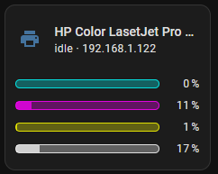
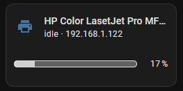
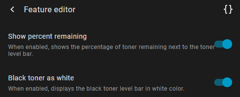

# Printer toner level feature for Home Assistant Tile card

[](https://github.com/hondzik/printer-toner-level-feature/releases)
[](LICENSE)
[](https://github.com/hacs/default)
[](https://github.com/hondzik)

[](https://github.com/hondzik/printer-toner-level-feature/commits/main)

[](https://my.home-assistant.io/redirect/hacs_repository/?repository=printer-toner-level-feature&owner=hondzik&category=Plugin)

This 'card feature' is used to display the current toner levels of printers.




Before using it, you first need to define your own template sensor, which stores the level of each toner in its attributes:

```yaml
- sensor:
    - name: "HP Color LasetJet Pro MFP M283fdw"
      state: "{{ states('sensor.hp_colorlaserjet_mfp_m282_m285_2') }}"
      icon: mdi:printer
      attributes:
        domain: "printer"
        ip: "{{ state_attr ('sensor.hp_colorlaserjet_mfp_m282_m285_2', 'uri_supported').split('/')[2] }}"
        cyan_level: "{{ states('sensor.hp_colorlaserjet_mfp_m282_m285_cyan_cartridge_hp_w2211a_2') }}"
        magenta_level: "{{ states('sensor.hp_colorlaserjet_mfp_m282_m285_magenta_cartridge_hp_w2213a_2') }}"
        yellow_level: "{{ states('sensor.hp_colorlaserjet_mfp_m282_m285_yellow_cartridge_hp_w2212a_2') }}"
        black_level: "{{ states('sensor.hp_colorlaserjet_mfp_m282_m285_black_cartridge_hp_w2210a_2') }}"
```
The way you fill in the individual attributes may vary depending on the integration used (I use IPP) and the type of printer. The only required attributes are _domain_ and _black_level_; the others are optional.

Next, you need to create a Tile card and select the created template sensor as the entity. In the Feature selection, you should be able to choose _Printer toner level_ (the option will appear based on the attribute domain: "printer").

For black-and-white printers, just set the grid_options.rows to 2; for color printers, you need to set the grid_options.rows to 3.

Configuration for a color printer may look like this:

```yaml
type: tile
entity: sensor.hp_color_lasetjet_pro_mfp_m283fdw
features_position: bottom
vertical: false
state_content:
  - state
  - ip
features:
  - type: custom:printer-toner-level-feature
grid_options:
  columns: 6
  rows: 3
```

The feature allows you to hide the percentage display and change the color of the black toner display. For this, use these configuration variables:

```yaml
features:
  - type: custom:printer-toner-level-feature
    show_percent: false
    black_as_white: false
```

You can also use config dialog do set theese options.


