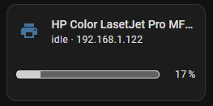
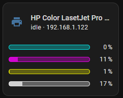
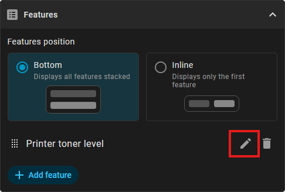
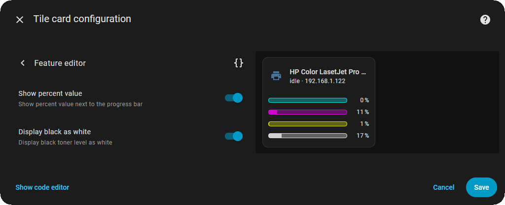
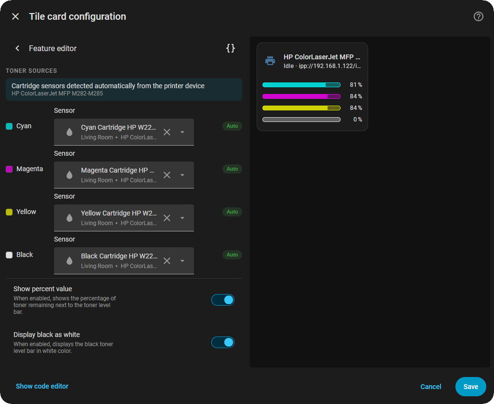

# Printer toner level feature for Home Assistant Tile card

[](https://github.com/hondzik/printer-toner-level-feature/releases)
[](LICENSE)
[](https://github.com/hondzik)

[](https://github.com/hondzik/printer-toner-level-feature/commits/main)


This is a Home Assistant Lovelace **Tile card feature** that renders a printer's toner/ink cartridge levels as small bar gauges underneath a Tile card, the same way built-in features like "Cover open/close" or "Light brightness" attach to a Tile card.




It automatically detects whether the printer is black-and-white or color (based on whether a cyan level is available from any source) and renders 1 bar (black only) or 4 bars (cyan, magenta, yellow, black) accordingly.

## How it works

For each color (cyan, magenta, yellow, black) the feature resolves a level from one of three sources, checked in this order:

1. **Manual entity** — a sensor you pick explicitly for that color in the feature's visual editor (or set as `<color>_entity` in YAML, e.g. `cyan_entity: sensor.my_cyan_cartridge`). Takes priority over everything else.
2. **Attributes on the Tile card's entity** — the original way this feature worked: a fixed set of attributes read off whichever entity the Tile card points at (see table below).
3. **Auto-discovered device sensor** — if the Tile card's entity belongs to a device that also exposes percent (`%`) sensors, the feature matches them to a color by looking for that color's name in the sensor's friendly name/entity id. This is the easiest way to get started if your printer integration (e.g. the built-in [IPP integration](https://www.home-assistant.io/integrations/ipp/)) already creates one sensor per cartridge on the same device — no template sensor required.

If none of the three sources produce a black level for the entity, the feature considers it unsupported and won't offer itself in the Lovelace feature picker for that entity.

Because sources 1 and 3 don't depend on attributes at all, the feature works with **any** printer integration — IPP, SNMP, a cloud API, or a hand-written template sensor — as long as the toner level ends up in *some* entity's state or attributes, one way or another.

### Attribute contract (source 2)

| Attribute      | Required | Type   | Description                                             |
| -------------- | -------- | ------ | --------------------------------------------------------- |
| `domain`       | yes      | string | Must be exactly `"printer"` — this is how the feature recognizes a compatible entity (see note below). |
| `black_level`  | yes      | number | Black toner/ink level, 0-100.                              |
| `cyan_level`   | no       | number | Cyan level, 0-100.                                          |
| `magenta_level`| no       | number | Magenta level, 0-100.                                      |
| `yellow_level` | no       | number | Yellow level, 0-100.                                        |
| `ip`           | no       | string | Not used by the feature itself, but handy to show in the Tile card's own `state_content` (see example below). |

> **Note on `domain: "printer"`:** this is a plain custom attribute you set yourself — it has nothing to do with the Home Assistant entity domain (the `sensor.` prefix in an entity ID). You could use this feature on a `sensor.*`, `binary_sensor.*` or any other entity type, as long as it carries this attribute. It exists purely so the feature can offer itself in the Lovelace feature picker only for entities that actually look like a supported printer, instead of showing up for every entity in your system.

### If a source entity goes unavailable

If the entity backing a resolved source becomes `unavailable` (e.g. the printer is off/unreachable), the feature falls back to the last known value from Home Assistant's recorder statistics instead of showing a blank bar. That bar is shown dimmed/italic, with a tooltip stating how old the value is.

## Setup

### 1. Install

Install through [HACS](https://hacs.xyz/) using the badge below, or add this repository manually as a custom HACS repository (category: plugin) if it isn't listed in the default store yet.

[](https://my.home-assistant.io/redirect/hacs_repository/?repository=printer-toner-level-feature&owner=hondzik&category=Plugin)

### 2. Get toner levels into the feature

If your printer integration already creates one sensor per cartridge on the same device as the entity you'll put on the Tile card (this is the case for the built-in [IPP integration](https://www.home-assistant.io/integrations/ipp/)), you can often skip straight to [step 3](#3-add-a-tile-card-and-the-feature) — the feature auto-discovers those sensors by matching a color name in their friendly name/entity id (see [How it works](#how-it-works), source 3). Open the visual editor afterwards to confirm the right sensors got picked up, and use the manual entity picker there to override any that didn't.

Otherwise, define a template sensor that stores each toner level as an attribute. The example below bundles the IPP integration's separate marker entities together into the attribute shape the feature expects (source 2 above):

```yaml
- sensor:
    - name: "HP Color LasetJet Pro MFP M283fdw"
      state: "{{ states('sensor.hp_colorlaserjet_mfp_m282_m285_2') }}"
      icon: mdi:printer
      attributes:
        domain: "printer"
        ip: "{{ state_attr('sensor.hp_colorlaserjet_mfp_m282_m285_2', 'uri_supported').split('/')[2] }}"
        cyan_level: "{{ states('sensor.hp_colorlaserjet_mfp_m282_m285_cyan_cartridge_hp_w2211a_2') }}"
        magenta_level: "{{ states('sensor.hp_colorlaserjet_mfp_m282_m285_magenta_cartridge_hp_w2213a_2') }}"
        yellow_level: "{{ states('sensor.hp_colorlaserjet_mfp_m282_m285_yellow_cartridge_hp_w2212a_2') }}"
        black_level: "{{ states('sensor.hp_colorlaserjet_mfp_m282_m285_black_cartridge_hp_w2210a_2') }}"
```

The way you fill in the individual attributes will vary depending on the integration/entities your specific printer exposes. Only `domain` and `black_level` are required — omit `cyan_level`/`magenta_level`/`yellow_level` entirely for a black-and-white printer, and the feature will render just the single black bar.

After adding this to your template sensor configuration, reload templates (Developer tools → YAML → Template entities) or restart Home Assistant, and confirm the new sensor shows the expected attributes on its "Attributes" tab before moving on.

### 3. Add a Tile card and the feature

Create a Tile card, pick the template sensor you just created as its entity, and add the feature. In the feature picker you should see **Printer toner level** listed (it only appears for entities carrying the `domain: "printer"` attribute).

Because the feature renders a fixed-height block of bars *underneath* the card's own header, the Tile card's height needs to be set explicitly via `grid_options.rows`, otherwise the bars get clipped or leave dead space:

- **Black-and-white printer** (1 bar): `grid_options.rows: 2`
- **Color printer** (4 bars): `grid_options.rows: 3`

Full example for a color printer:

```yaml
type: tile
entity: sensor.hp_color_lasetjet_pro_mfp_m283fdw
features_position: bottom
vertical: false
state_content:
  - state
  - ip
features:
  - type: custom:printer-toner-level-feature
grid_options:
  columns: 6
  rows: 3
```

`state_content: [state, ip]` is what shows the "idle · 192.168.1.122" line under the card title — this reads the template sensor's own `state` and the `ip` attribute defined in step 2, and is entirely optional/independent of the feature.

## Configuration options

All options are settable either through YAML or the visual editor (pencil icon on the feature, see [below](#using-the-visual-editor)):

| Option           | Type    | Default | Description                                                                 |
| ----------------- | ------- | ------- | ---------------------------------------------------------------------------- |
| `cyan_entity`      | string  | —       | Manually pick the entity used as the cyan source, overriding the attribute/auto-discovered source. |
| `magenta_entity`   | string  | —       | Same, for magenta.                                                          |
| `yellow_entity`    | string  | —       | Same, for yellow.                                                           |
| `black_entity`     | string  | —       | Same, for black.                                                            |
| `show_percent`     | boolean | `true`  | Show the numeric percentage next to each bar.                                |
| `black_as_white`   | boolean | `true`  | Render the black toner bar in white instead of black — useful for it to stay visible on a dark bar background rather than blending into it. |

```yaml
features:
  - type: custom:printer-toner-level-feature
    cyan_entity: sensor.printer_cyan_cartridge
    show_percent: false
    black_as_white: false
```

## Using the visual editor

Instead of editing YAML, you can use the "Edit feature" (pencil) icon next to the feature in the card's feature list:



Clicking it opens the Tile card configuration dialog. For each color it shows which entity is currently in use (a chip marks it **auto** or **manual**) and lets you pick a different entity via the selector, or reset back to the attribute/auto-discovered source with the reset button. Below that are the `show_percent` and `black_as_white` toggles described above:



### Without a template sensor (auto-discovered sensors)

If you skipped the template sensor step in [step 2](#2-get-toner-levels-into-the-feature) and are relying on auto-discovery (source 3 in [How it works](#how-it-works)), the banner at the top of the dialog reflects that instead: it states that cartridge sensors were detected automatically from the printer device, and names the device they were found on. Each color whose sensor was found this way shows an **auto** chip rather than **manual** — pick a different entity via the selector if the wrong sensor got matched, which turns that row into a manual override with a reset button to go back to the auto-discovered one:



## Troubleshooting

- **"Printer toner level" doesn't show up in the feature picker** — the feature needs a black level from *some* source: either the entity has an attribute literally named `domain` with the literal string value `printer` plus a numeric `black_level`, or a percent sensor on the same device has "black" in its name. Check the entity's "Attributes" tab (for the attribute route) or the device's other sensors (for auto-discovery) in Developer tools.
- **Bars look cut off or there's empty space below them** — set `grid_options.rows` to 2 (black-and-white) or 3 (color) as described above; the feature does not auto-size the card.
- **Only a black bar shows even though the printer is color** — no cyan source resolved for the entity: check that `cyan_level` is present (not `null`/omitted) if you're using the attribute contract, that a cyan sensor exists on the same device if you're relying on auto-discovery, or set `cyan_entity` manually.
- **Wrong sensor got auto-discovered for a color** — auto-discovery matches by color name in the sensor's friendly name/entity id, so it can pick the wrong sensor if names are ambiguous. Open the visual editor and set that color's entity manually.

## Contributors

[](https://github.com/hondzik/printer-toner-level-feature/graphs/contributors)
